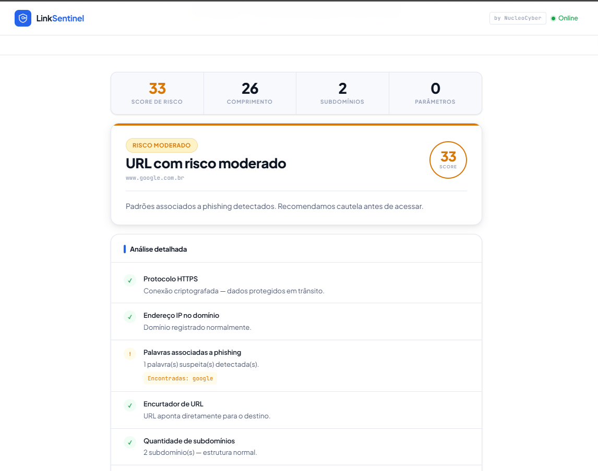

# 🔗 LinkSentinel — NucleoCyber

> Ferramenta de análise de URLs suspeitas em tempo real. Detecta phishing, domínios maliciosos, encurtadores e imitações de marcas antes que você acesse o link.


---

## 🌐 Demo ao vivo

**[→ DevLucasAls.github.io/linksentinel](https://DevLucasAls.github.io/linksentinel)**

---

## 📸 Preview



---

## 🚀 Funcionalidades

### 🔍 Análise de URLs em Tempo Real
- **8 verificações independentes** executadas simultaneamente
- **Score de risco de 0 a 100** com 5 níveis de ameaça
- Barra de progresso com etapas reais de análise
- Feedback visual imediato com cores semânticas

### 🛡️ Verificações de Segurança

| Verificação | Peso | O que detecta |
|---|---|---|
| Protocolo HTTPS | 20 pts | Falta de criptografia na conexão |
| IP no domínio | 30 pts | URLs com IP direto no lugar do domínio |
| Palavras de phishing | até 25 pts | login, verify, secure, update e mais 26 termos |
| Encurtadores | 15 pts | bit.ly, tinyurl, t.co e 14 outros serviços |
| Subdomínios excessivos | 15 pts | Mais de 2 subdomínios — padrão de mascaramento |
| TLD suspeito | 15 pts | .tk, .ml, .xyz, .top e 16 outras extensões |
| URL muito longa | 10 pts | Mais de 100 caracteres |
| Imitação de marca | 25 pts | PayPal, Apple, Google, Amazon e outras 14 marcas |

### 📊 Níveis de Ameaça

| Score | Nível | Significado |
|---|---|---|
| 0 | ✅ Segura | Nenhum indicador detectado |
| 1–20 | 🟢 Baixo Risco | Poucos indicadores, acesse com atenção |
| 21–45 | 🟡 Risco Moderado | Padrões suspeitos, cautela recomendada |
| 46–70 | 🟠 Alto Risco | Múltiplos indicadores, evite acessar |
| 71–100 | 🔴 Perigo | Fortes indícios de ataque, não acesse |

### 📋 Histórico de Scans
- Armazena até 8 scans da sessão atual
- Clique em qualquer entrada para reanalisar
- Indicador colorido por nível de risco

---

## 🧠 Conceitos de Cyber Security Aplicados

| Conceito | Aplicação |
|---|---|
| **URL Parsing** | API nativa `new URL()` para desmontagem estrutural |
| **Pattern Matching** | Listas de palavras e regex para detecção de phishing |
| **Threat Scoring** | Sistema de pontuação ponderada por nível de risco |
| **TLD Analysis** | Verificação contra lista de extensões abusadas |
| **Brand Impersonation** | Detecção de domínios que imitam marcas conhecidas |
| **URL Shortener Detection** | Lista de 18 encurtadores conhecidos |

---

## 🛠 Tecnologias

- **HTML5** — Estrutura semântica e acessível
- **CSS3** — Design system com variáveis, Grid, animações, responsivo
- **JavaScript Vanilla** — Sem dependências externas
- **URL API** — Parsing nativo do browser
- **Google Fonts** — Plus Jakarta Sans + JetBrains Mono

---

## 📁 Estrutura

```
nucleocyber-linksentinel/
├── linksentinel.html   # Aplicação completa (single file)
├── README.md           # Este arquivo
└── preview.png         # Screenshot do projeto
```

---

## ⚙️ Como rodar localmente

```bash
# Clone o repositório
git clone https://github.com/DevLucasAls/nucleocyber-linksentinel.git

# Abra no browser
open linksentinel.html
```

Não precisa de servidor ou dependências — abre direto no browser.

---

## 🔒 Privacidade

- ✅ Nenhuma URL é armazenada em servidor
- ✅ Toda análise é feita localmente no browser
- ✅ Sem cookies, sem tracking, sem analytics
- ✅ Nenhum dado enviado a terceiros

---

## ⚠️ Limitações

Esta é uma análise **estática e local** — sem acesso a bancos de dados de ameaças em tempo real. Em um ambiente de produção real, seria integrada com:

- [Google Safe Browsing API](https://safebrowsing.google.com/) — Lista negra de URLs maliciosas
- [VirusTotal API](https://www.virustotal.com/) — Análise por múltiplos antivírus
- [URLScan.io](https://urlscan.io/) — Escaneamento visual de páginas

---

## 📚 O que aprendi com este projeto

- Como estruturar um sistema de **pontuação de risco ponderada**
- Técnicas reais de **detecção de phishing** usadas em ferramentas profissionais
- Como usar a **URL API nativa** do JavaScript para parsing seguro
- Padrões comuns em **ataques de phishing** e como identificá-los
- Design de interfaces no estilo **SaaS moderno** com seções e landing page
- Como documentar limitações técnicas de forma profissional

---

## 🗺 Próximos passos

- [ ] Integração com Google Safe Browsing API
- [ ] Verificação de certificado SSL em tempo real
- [ ] Exportar relatório em PDF
- [ ] Verificação de data de registro do domínio (WHOIS)
- [ ] Suporte a análise em lote (múltiplas URLs)

---

## 🔗 Outros projetos NucleoCyber

- **[KeySentinel](https://github.com/DevLucasAls/nucleocyber-password-analyzer)** — Analisador de força de senhas com verificação HIBP

---

## 👤 Autor

**Lucas Augusto Leal Sales**
- GitHub: [DevLucasAls](https://github.com/DevLucasAls)
- LinkedIn: [linkedin.com/in/lucasals](https://linkedin.com/in/lucasals)

---

## 📄 Licença

Este projeto está sob a licença MIT — veja o arquivo [LICENSE](LICENSE) para detalhes.

---

<p align="center">
  Feito com 🔐 por <strong>NucleoCyber</strong>
</p>
